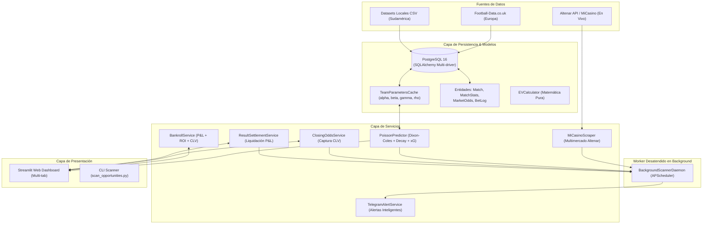

# ⚽ Betting Analytics - Motor Cuantitativo & Radar de Valor (+EV)

Sistema integral de analítica cuantitativa, modelado predictivo bivariado y escaneo en tiempo real diseñado para identificar, auditar y ejecutar sistemáticamente apuestas de fútbol con **Valor Esperado Positivo (+EV)**.

El proyecto integra el motor estadístico **Dixon-Coles** con decaimiento temporal y Expected Goals ($xG$), consumo directo de cuotas en vivo a través de la API de **Altenar (MiCasino)**, alertas inteligentes automatizadas mediante un worker daemon en **Telegram**, dimensionamiento óptimo de apuestas con el **Criterio de Kelly (Quarter Kelly)**, captura desatendida de **Cuotas de Cierre (Closing Odds / CLV)**, **liquidación automática de apuestas** y arquitectura contenerizada con **Docker & PostgreSQL**.

---

## 📌 Tabla de Contenidos

1. [Novedades y Mejoras Implementadas](#-novedades-y-mejoras-implementadas)
2. [Características Principales](#-características-principales)
3. [Arquitectura del Sistema](#-arquitectura-del-sistema)
4. [Estructura del Proyecto](#-estructura-del-proyecto)
5. [Fundamentos Matemáticos y Cuantitativos](#-fundamentos-matemáticos-y-cuantitativos)
   - [Modelo Dixon-Coles Bivariado](#1-modelo-dixon-coles-bivariado)
   - [Ponderación Temporal Exponencial (Calibración $\xi$)](#2-ponderación-temporal-exponencial-calibración-xi)
   - [Integración de Expected Goals ($xG$)](#3-integración-de-expected-goals-xg)
   - [Expansión a Nuevos Mercados Analíticos](#4-expansión-a-nuevos-mercados-analíticos)
   - [Cálculo de Ventaja (Edge) y Valor Esperado (+EV)](#5-cálculo-de-ventaja-edge-y-valor-esperado-ev)
   - [Gestión de Riesgo: Quarter Kelly](#6-gestión-de-riesgo-quarter-kelly)
   - [Auditoría Automatizada de CLV](#7-auditoría-automatizada-de-clv)
6. [Fuentes de Datos e Ingesta](#-fuentes-de-datos-e-ingesta)
7. [Módulos del Sistema](#-módulos-del-sistema)
8. [Dashboard Interactivo (Streamlit)](#-dashboard-interactivo-streamlit)
9. [Worker Daemon en Background & Alertas Inteligentes](#-worker-daemon-en-background--alertas-inteligentes)
10. [Despliegue con Docker & Docker Compose](#-despliegue-con-docker--docker-compose)
11. [Requisitos e Instalación Local](#-requisitos-e-instalación-local)
12. [Configuración de Entorno (.env)](#-configuración-de-entorno-env)
13. [Mapeo de Entidades y Base de Datos](#-mapeo-de-entidades-y-base-de-datos)

---

## 🌟 Novedades y Mejoras Implementadas

### 1. Refinamiento Estadístico del Modelo Dixon-Coles
- **Calibración del factor de decaimiento temporal ($\xi \approx 0.0035$ o MLE)**: Implementación de ponderación exponencial continua donde los partidos de hace 2 semanas pesan $\approx 95\%$ y los de hace un año apenas un $\approx 28\%$. Incluye estimador de máxima verosimilitud (MLE) y calibración sobre rejilla temporal.
- **Métrica xG (Goles Esperados) como variable explicativa**: Soporte para combinar goles reales observados con $xG$ (o estimadores sintéticos derivados de tiros a puerta $HST$ y córners $HC$), reduciendo drásticamente el ruido de la varianza en muestras cortas.
- **Nuevos mercados analíticos**: Expansión de la matriz probabilística conjunta a **Ambos Equipos Anotan (BTTS)**, **Apuesta Sin Empate (Draw No Bet / AH 0.0)**, **Doble Oportunidad (AH +0.5 / 1X / X2)** y **Líneas de Hándicap Asiático** (-1.5, -1.0, -0.5, 0.0, +0.5, +1.0, +1.5).

### 2. Automatización Desatendida (Scanner en Segundo Plano)
- **Worker en Background (`BackgroundScannerDaemon`)**: Proceso independiente desacoplado de la interfaz de Streamlit utilizando `APScheduler`. Escanea periódicamente las líneas de Altenar cada 5 a 15 minutos sin intervención manual.
- **Alertas Inteligentes por Telegram (`TelegramAlertService`)**: Despacho automático filtrado estrictamente por:
  - $\text{Edge} \ge 4.0\%$
  - Rango de cuotas viables ($1.60 \le \text{odds} \le 3.50$)
  - Confirmación de liquidez y probabilidad mínima ($p_{\text{model}} \ge 15\%$)
  - Ventana de enfriamiento (*cooldown*) anti-spam para evitar alertas repetidas de la misma cuota.

### 3. Cierre Automático y Auditoría de CLV
- **Captura automática de la Cuota de Cierre (`ClosingOddsService`)**: Tarea programada que consulta las cuotas disponibles antes del pitido inicial de cada partido para registrar automáticamente el valor en `closing_odds` y computar el **Closing Line Value (CLV)** sin depender de carga manual.
- **Liquidación de resultados desatendida (`ResultSettlementService`)**: Tarea programada que cruza automáticamente las apuestas pendientes contra los marcadores de partidos disputados, resolviendo el estado a `WON`, `LOST` o `VOID` y calculando el P&L exacto con notificación a Telegram.

### 4. Robustez de Arquitectura
- **Aislamiento definitivo en Docker**: Empaquetado completo con `Dockerfile` y `docker-compose.yml` que orquesta la base de datos PostgreSQL 16, la aplicación web Streamlit y el worker daemon de fondo.
- **Driver de base de datos ultra-estable**: Detección y fallback multinivel (`psycopg2` $\to$ `psycopg3` $\to$ `pg8000`), eliminando cualquier conflicto de DLLs en Windows o permisos en Linux.
- **Caché persistente de parámetros de equipos (`TeamParametersCache`)**: Almacena los parámetros calculados $\alpha, \beta, \gamma, \rho$ en PostgreSQL con tiempo de vida (TTL), acelerando las consultas del radar y Streamlit de segundos a milisegundos.

---

## 🏛️ Arquitectura del Sistema



---

## 📂 Estructura del Proyecto

```text
betting_analytics/
│
├── config/                          # Configuraciones del sistema
├── data/                            # Datasets locales en formato CSV (Argentina, Bolivia)
├── src/
│   ├── controllers/
│   │   ├── __init__.py
│   │   └── simulation_controller.py # Evaluación de valor (+EV) y filtro de ventajas
│   │
│   ├── models/
│   │   ├── __init__.py
│   │   ├── database.py              # Engine SQLAlchemy con fallback (psycopg2 / psycopg / pg8000)
│   │   ├── entities.py              # Modelos ORM: Match, MatchStats, MarketOdds, BetLog, TeamParametersCache
│   │   └── ev_calculator.py         # Cálculos de probabilidad implícita y valor esperado
│   │
│   ├── services/
│   │   ├── __init__.py
│   │   ├── background_scanner.py    # Daemon desatendido multiligas con APScheduler
│   │   ├── backroll_service.py      # Gestión de bankroll, P&L, ROI y auditoría de CLV
│   │   ├── closing_odds_service.py  # Captura automática de cuotas de cierre y cálculo de CLV
│   │   ├── historical_football_loader.py # Ingesta desde Football-Data.co.uk
│   │   ├── micasino_scraper.py      # Conector HTTP/JSON a Altenar (1X2, Over/Under, BTTS, DNB, AH)
│   │   ├── poisson_model.py         # Motor predictivo Dixon-Coles (Decaimiento ξ, xG, matrices conjuntas)
│   │   ├── result_settlement_service.py # Liquidación desatendida de resultados y cómputo de P&L
│   │   ├── south_america_loader.py  # Ingestor para ligas sudamericanas desde CSV
│   │   └── telegram_service.py      # Alertas inteligentes filtradas para Telegram
│   │
│   ├── utils.py                     # Catálogo de ligas, alias de equipos, clean_str y Kelly fraccional
│   └── views/
│       ├── __init__.py
│       ├── console_view.py          # Salida formateada por consola
│       └── streamlit_view.py        # Dashboard reactivo con controles de calibración y CLV
│
├── Dockerfile                       # Contenedor optimizado Python 3.11-slim
├── docker-compose.yml               # Orquestación de DB, App Streamlit y Worker Daemon
├── .dockerignore                    # Exclusiones de construcción Docker
├── requirements.txt                 # Dependencias congeladas en UTF-8
├── run_bot_scanner.py               # Punto de entrada para el Daemon en segundo plano
├── scan_opportunities.py            # Escáner multimercado bajo demanda por consola
└── test_pipeline.py                 # Pipeline de validación integral y pruebas automáticas
```

---

## 🧮 Fundamentos Matemáticos y Cuantitativos

### 1. Modelo Dixon-Coles Bivariado

$$P(X = x, Y = y) = \tau(x, y) \cdot \frac{\lambda^x e^{-\lambda}}{x!} \cdot \frac{\mu^y e^{-\mu}}{y!}$$

Donde la función de ajuste $\tau(x, y)$ corrige la dependencia empírica en marcadores bajos:

$$\tau(x, y) = \begin{cases}
1 - \lambda \mu \rho & \text{si } x = 0, y = 0 \\
1 + \lambda \rho & \text{si } x = 0, y = 1 \\
1 + \mu \rho & \text{si } x = 1, y = 0 \\
1 - \rho & \text{si } x = 1, y = 1 \\
1 & \text{para otros marcadores}
\end{cases}$$

### 2. Ponderación Temporal Exponencial (Calibración $\xi$)

Cada partido jugado hace $\Delta t$ días recibe una ponderación:

$$w(\Delta t) = \exp(-\xi \cdot \Delta t)$$

Con $\xi = 0.0035$ (calibrable vía MLE o rejilla temporal), la semivida es de $\approx 198$ días. Un encuentro disputado hace 14 días tiene un peso de $\approx 95.2\%$, mientras que uno disputado hace un año pesa tan sólo $\approx 27.8\%$.

### 3. Integración de Expected Goals ($xG$)

Para reducir el ruido y la suerte en muestras cortas, los goles efectivos se calculan como una combinación convexa:

$$G_{\text{efectivo}} = (1 - w_{xg}) \cdot G_{\text{real}} + w_{xg} \cdot xG$$

Si el proveedor no suministra $xG$ directo, el sistema recurre a un estimador sintético de peligro generado a partir de tiros a puerta ($HST$) y tiros de esquina ($HC$):

$$xG_{\text{sintético}} \approx 0.31 \cdot HST + 0.035 \cdot HC$$

### 4. Expansión a Nuevos Mercados Analíticos

A partir de la matriz normalizada $M_{x, y} = P(X=x, Y=y)$:
- **Ambos Equipos Anotan (BTTS)**:
  $$P(\text{BTTS Sí}) = \sum_{x=1}^{K} \sum_{y=1}^{K} M_{x, y} = 1 - P(\text{BTTS No})$$
- **Apuesta Sin Empate (Draw No Bet / AH 0.0)**:
  $$P(\text{Local DNB}) = \frac{P(X > Y)}{1 - P(X = Y)}$$
- **Hándicap Asiático ($\text{AH } h$)**:
  $$P(\text{AH } h) = \sum_{x - y + h > 0} M_{x, y}$$

---

## 🐳 Despliegue con Docker & Docker Compose

Para levantar todo el stack sin dependencias locales ni problemas de controladores:

```bash
docker compose up -d --build
```

Esto iniciará:
1. `betting_postgres`: PostgreSQL 16 con volumen persistente `pgdata`.
2. `betting_streamlit`: Dashboard accesible en `http://localhost:8501`.
3. `betting_background_worker`: Daemon autónomo que escanea cada 10 min, captura cuotas de cierre y liquida apuestas.

Para ver los logs en vivo del worker:
```bash
docker compose logs -f scanner
```

---

## 🚦 Guía de Ejecución Local

### 1. Iniciar el Dashboard Web
```bash
streamlit run src/views/streamlit_view.py
```

### 2. Iniciar el Worker Daemon en Background
```bash
python run_bot_scanner.py
```

### 3. Escaneo Inmediato por Consola
```bash
python scan_opportunities.py
```

### 4. Validar el Pipeline y Ejecutar Pruebas
```bash
python test_pipeline.py
```
